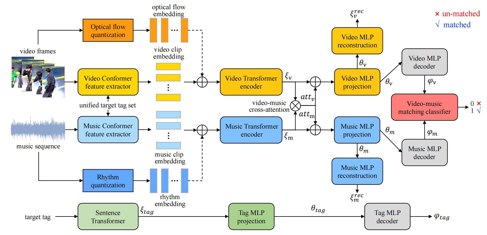

# UT-CMVMR
Official code for our paper Unified Pretraining Target Based Video-Music Retrieval with Music Rhythm and Video Optical Flow Information.

[[Paper](http://arxiv.org/abs/2309.09421)]

[[Project Page](https://melissamao.github.io/ut_cmvmr.github.io/)]
## Introduction
Background music (BGM) can enhance the video's emotion. However, selecting an appropriate BGM often requires domain knowledge. This has led to the development of video-music retrieval techniques. Most existing approaches utilize pretrained video/music feature extractors trained with different target sets to obtain average video/music-level embeddings. The drawbacks are two-fold. One is that different target sets for video/music pretraining may cause the generated embeddings difficult to match. The second is that the underlying temporal correlation between video and music is ignored. The proposed approach leverages a unified target set to perform video/music pretraining and produce clip-level embeddings to preserve temporal information. The downstream cross-modal matching is based on the clip-level features with embedded music rhythm and optical flow information. Experiments demonstrate that our proposed method can achieve superior performance over the state-of-the-art methods.


## Directory Structure
```
.
├── ...
├── ut_cmvmr              
│   ├── config
│   │   │── config_pre_rhythm.yaml
│   ├── data
│   │   │   │── audio
│   │   │   │── text
│   │   │   │── pair_meta
│   │   │   │── rhythm_meta
│   │   │   │── optic_flow_meta
│   │   │── se_dataloader.py
│   ├── data_preprocess
│   │   │   │── audio
│   │   │   │── video
│   │   │   │── tag
│   │   │   │── conformer_pretrain
│   │   │   │   │── conformer_pretrain
│   │   │   │   │── conformer_pretrain_video
│   ├── utils
└── ...
```
## Preparation
### prepare for the environment
The environment need python == 3.8.2, torch == 1.11.0, cuda10.2 and v100 * 1. 
```
pip install -r requirement.txt
```
### prepare for files
Before training, we need to prepare the lmdb files for the text embedding. In this work, we utilize [sentence-transformers](https://github.com/UKPLab/sentence-transformers)
to extract the text embedding. The lmdb files need to be stored in "./data/text/". We provide scripts to finish the step:
```
python ./data_preprocess/tag/alljson_to_tag_lmdb.py [input_json] [out_lmdb]
```
Besides, you also need to prepare those files:
```
train_txt_vid_list: ./data/pair_meta/monthly_pair_meta/train_vid_noless2.txt
test_txt_vid_list: ./data/pair_meta/monthly_pair_meta/test_vid_mid_in_gallery.txt
valid_txt_vid_list: ./data/pair_meta/monthly_pair_meta/valid_vid.txt
test_txt_aid.list: ./data/pair_meta/music_gallery/gallery_id_in_all.txt
json_path: ./data/pair_meta/tags/all_vid_aid_tag_noless2.json
```
train_txt_vid_list, test_txt_vid_list and valid_txt_vid_list are txt files containing video ids for stages of training, testing and validing. Text_txt_aid_list contains list of music gallery for recall. Json_path is a json file using video id as the key and music is as the value(In common practice of video background recommendation, the relation between video and music is many-to-one).
## Usage
### Train Conformer Extractors

Before start to train the feature extractors, you need to get lmdb files storing the raw information of video and music:

```
cd data_preprocess/audio
python make_audio_lmdb.py --audio_path [audio_path] --out_path [out_path]

```

also for video:

```
cd data_preprocess/video
python make_video_lmdb_pure_video.py ----video_path [video_path] --out_path [out_path]

```

train the conformer extractor for the audio data, the pth files are stored in path"./data_preprocess/conformer_pretrain/conformer_pretrain/checkpoints":
```
cd data_preprocess/conformer_pretrain/conformer_pretrain
python train_conformer.py

```
train the conformer extractor for the video data, the pth files are stored in path"./data_preprocess/conformer_pretrain/conformer_pretrain_video/checkpoints":
```
cd data_preprocess/conformer_pretrain/conformer_pretrained_video
python train_conformer.py

```
### Extracted features extracted by Conformer Extractor
The inputs for this step are an lmdb file storing the original audio data (keyed by the audio id), a txt text file with the audio id, the pth address of the pre-trained Conformer Extractor, and a configuration file.
```
cd data_preprocess/audio
python make_pretrained_audio_lmdb.py 
```
An lmdb file with the Conformer Extractor features for audio can be obtained. In the next step, the same operation is performed for video data.
```
cd data_preprocess/video
python make_pretrained_video_lmdb.py
```

### Extracting optical flow and rhythmic features
The input is an lmdb file storing the original audio data (keyed by the audio id) and the output is a file with the audio tempo.
```
cd data_preprocess/audio
python calculate_audio_rhythm_info.py
```
Quantifying rhythm:
```
python quantize_rhythm_info.py
```

Input is an lmdb file storing the original video data (keyed by the audio id), output is a file with the video stream information.
```
cd data_preprocess/audio
python calculate_video_optical_flow.py
```
Quantifying optical flow information:
```
python quantize_optical_flow_info.py
```
### Train and Test
```
python train_pretrained.py
```

## Acknowledgements
This code contains elements from the following repos:

1.[sentence-transformers](https://github.com/UKPLab/sentence-transformers)

2.[conformer](https://github.com/sooftware/conformer)

3.[Video-Music_Cross-Modal_Retrival](https://github.com/MorrisXu-Driving/Video-Music_Cross-Modal_Retrival)


## Citation
If you find the listing and survey useful for your work, please cite the paper:
```
@misc{mao2023unified,
      title={Unified Pretraining Target Based Video-music Retrieval With Music Rhythm And Video Optical Flow Information}, 
      author={Tianjun Mao and Shansong Liu and Yunxuan Zhang and Dian Li and Ying Shan},
      year={2023},
      eprint={2309.09421},
      archivePrefix={arXiv},
      primaryClass={cs.MM}
}
```